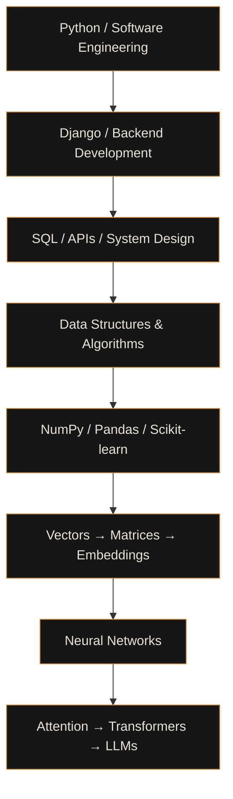

<div align="center">


<a href="https://github.com/abdullah-dev-5">
  
</a>

<br/>


</div>

<br/>

Building backend systems, developer tools, and data-structure visualizations with Python. CS student, working mostly in Django and PostgreSQL.

```text
$ whoami
abdullah-dev-5

$ focus
backend engineering

$ build
django • python • postgres
```

## stack

**Main**


`Django Ninja` · `SQL` · `HTMX`

**Learning**


**Exploring** · machine learning (NumPy, Pandas, scikit-learn)

## projects

<table>
<tr>
<td width="50%" valign="top">

**Pipeline**<br/>
Job application tracker with status management, search, filtering, a dashboard, and reminders.<br/><br/>
<br/>
<sub>status: in development</sub> · <a href="YOUR_REPO_LINK">repo</a>

</td>
<td width="50%" valign="top">

**Data Structure & Algorithm Visualizer**<br/>
Python Dash app for understanding data structures and algorithms. Some structures are implemented so far, with more planned.<br/><br/>
 <code>Dash</code> <code>Plotly</code><br/>
<sub>status: in development</sub> · <a href="YOUR_REPO_LINK">repo</a>

</td>
</tr>
<tr>
<td width="50%" valign="top">

**TaskHUB**<br/>
Task management application built for learners.<br/><br/>
<br/>
<code>Django Ninja</code> <code>HTMX</code><br/>
<sub>status: in development</sub> · <a href="YOUR_REPO_LINK">repo</a>

</td>
<td width="50%" valign="top">

**Shop IT**<br/>
E-commerce project with products, sellers, user profiles, carts, and seller functionality.<br/><br/>
<br/>
<sub>status: school project</sub> · <a href="YOUR_REPO_LINK">repo</a>

</td>
</tr>
<tr>
<td width="50%" valign="top">

**Graft**<br/>
Document analysis project for tender-related documents, with document uploads and analysis structures.<br/><br/>
<br/>
<sub>status: in development</sub> · <a href="YOUR_REPO_LINK">repo</a>

</td>
<td width="50%" valign="top">

</td>
</tr>
</table>

## currently

- Django backend development and API design
- PostgreSQL and SQL
- Data structures and algorithms
- Linux and system fundamentals
- Software architecture
- Machine learning fundamentals, later

## direction



## github

Most of my activity comes from building, debugging, learning, and iterating on projects.

<div align="center">


<picture>
  <source media="(prefers-color-scheme: dark)" srcset="https://raw.githubusercontent.com/abdullah-dev-5/abdullah-dev-5/output/github-snake-dark.svg" />
  
</picture>

</div>
## contact

<div align="center">

<a href="https://github.com/abdullah-dev-5"></a>
<a href="https://www.linkedin.com/in/abdullah-hussain-6b179739b/"></a>
<a href="mailto:abdullahdev12125@gmail.com"></a>


</div>
